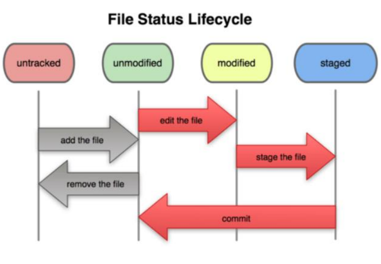

# 클라우드 수업 정리 3주차

# 📒 Git 노트

---

## 1. Git 이란?

> **DVCS (Distributed Version Control System)** : 분산 버전 관리 시스템
> 
- 소프트웨어 개발 과정에서 **소스 코드의 변경 사항을 추적하고 관리**하는 데 사용
- 많은 개발사에서 사용 중

### 💡 Git이 필요한 이유

- 만약… 내가 짠 소스를 **어제로 돌리고** 싶다면?
- 만약… 내가 테스트로 **기능을 몇 가지 추가**하고 싶다면?
- 나의 소스코드를 **협업**하고 싶다면?

---

## 2. Git 사용 방법

| 방식 | 설명 | 도구 예시 |
| --- | --- | --- |
| **CLI** (Command-Line Interface) | 명령어 기반 인터페이스 | 터미널, 콘솔, 명령 프롬프트(cmd) |
| **GUI** (Graphical User Interface) | 그래픽 기반 인터페이스 | GitHub Desktop, SourceTree |

---

## 3. Git 설치

- 다운로드 주소: https://git-scm.com/downloads

### ✅ 설치 시 주의사항

1. **Git Bash 포함 여부 확인** (Windows Explorer integration → Open Git Bash here 체크)
2. **Git을 사용할 에디터 선택** → 자신에게 익숙한 에디터 선택!
3. **기본 분기 이름 사용 (Master)** → `Let Git decide` 선택
4. **Credential Helper 설정**
    - `None` : Git에서 인증정보 입력마다 **매번 사용자 이름과 비밀번호 입력**
    - 개인 PC의 경우, **Git Credential Manager 체크** 권장

---

## 12. git 계정 정보 세팅

> Git 전역으로 사용자 이름과 이메일 주소 설정
> 

```bash
# 사용 방법
git config --global user.name "(본인 이름)"
git config --global user.email "(본인 이메일)"

# 예시
git config --global user.name "anhr"
git config --global user.email "anhr@shingu.ac.kr"

# 확인
git config --global user.name
git config --global user.email
```

---

## 13. Git 기본 branch 세팅

```bash
git config --global init.defaultBranch main
```

- 기본 브랜치 명이 `main` 으로 설정됨
- ⚠️ 사이트마다 상이하나 **Master**로 쓰는 경우도 있음

---

## 18. git status

> `git status` 명령어로 확인할 수 있는 정보
> 

| 상태 | 설명 |
| --- | --- |
| **추적되지 않은 파일들** | Git이 아직 관리하지 않는 파일들을 보여줌 |
| **변경된 파일들** | Git이 추적하고 있는 파일 중 수정되었으나 아직 스테이징되지 않은 파일들을 보여줌 |
| **스테이징된 파일들** | 다음 커밋에 포함될 준비가 된, 즉 `git add`를 통해 스테이징된 파일 목록을 보여줌 |

---

## 22. git 예외처리 방법 — `.gitignore`

- `.gitignore` 파일을 사용하여 **Git 추적에서 특정 파일/폴더를 배제** 가능
- 예) 로그파일, 빌드결과물, 보안상 민감한 파일, `.DS_store` 등..
- 프로젝트 루트 경로에 `.gitignore` 파일을 생성하여 사용

---

## 26. `.gitignore` 작성 규칙

> 참고: https://git-scm.com/docs/gitignore
> 

```
# 주석
# 이렇게 주석을 작성할 수 있다

secrets.yaml          # 파일 이름을 지정하여 예외
/secrets.yaml         # 최상위 폴더의 파일만 예외
*.yaml                # 확장자로 지정하여 예외 (모든 yaml 파일)
!main.yaml            # yaml 확장자지만 무시하지 않을 파일 (예외의 예외)
logs                  # logs란 이름의 파일, 폴더 그 내용들
logs/                 # logs란 이름의 폴더와 그 내용들
logs/*.txt            # logs 폴더 안에 있는 txt 파일들
```

---

> 📌 **메모**: `.git` 폴더는 git으로 관리하는 내역들이 저장되는 곳. **절대 삭제 금지!** (삭제 시 복구 불가)
> 

# 📒 Git 초급 노트

---

## 1. Git의 단계 (commit의 이해)

> **Commit** : 변경 사항을 Git 저장소에 **영구적으로 기록**하는 작업
> 

| 단계 | 설명 |
| --- | --- |
| **Working Directory** | 소스코드 작업하는 영역, 내가 작업하고 있는 프로젝트의 디렉토리 |
| **Staging Area** | 워킹 디렉토리에서 `git add` 명령어를 통해 추가한 파일들이 모여 있는 공간 |
| **Repository** | Staging Area에 있는 소스코드들이 `commit` 명령을 실행하면 최종적으로 Git 저장소에 반영 됨 |

---

## 2. 파일의 생명주기 (File Status Lifecycle)

| 상태 | 설명 |
| --- | --- |
| **Untracked** | Working Directory에 있는 파일이지만 Git으로 버전관리를 하지 않는 상태. 파일이 있으나 한 번도 `add` 되지 않은 상태 |
| **Unmodified** | 신규로 파일이 추가되었을 때, `new file` 상태와 같음. 파일을 `add`하여 `commit`을 1회 이상 한 뒤, 수정사항 없음 |
| **Modified** | 파일이 추가된 이후 해당 파일이 수정되었을 때의 상태 |
| **Staged** | Staging Area에 반영된 상태, `git add` 한 상태 |

### 상태 전환 흐름



---

## 3. 실습) 파일의 생명주기 확인

### ① Untracked 상태 확인

```bash
$ git status
# → Untracked files: a.txt, b.txt 표시
```

### ② git add로 신규 파일 추가 → Unmodified(= new file) 상태

```bash
$ git add a.txt
$ git status
# → Changes to be committed:
#       new file: a.txt
```

### ③ 파일 수정 → Modified 상태

```bash
# a.txt 파일 수정 후
$ git status
# → Changes not staged for commit:
#       modified: a.txt
```

### ④ commit → Repository에 기록

```bash
$ git commit a.txt -m "파일생명주기를 위해 a.txt추가"
# → [main (root-commit) 7abd456] 파일생명주기를 위해 a.txt추가
#    1 file changed, 2 insertions(+)
```

> 💡 commit 형식: `git commit 파일 -m "로그메세지"`
commit = Staging Area에서 **Repository로 이동**하는 것
> 

---

## 4. 이전 버전으로 원복해야 된다면?

| 명령어 | 설명 |
| --- | --- |
| **reset** | 원하는 시점으로 돌아간 뒤 **이후 내역들 삭제** |
| **revert** | 되돌리기 원하는 시점의 커밋을 **거꾸로 실행** (기록 보존) |

---

## 5. reset

> **HEAD** : 현재 작업 중인 브랜치나 커밋을 가리키는 포인터
> 

### reset 동작 방식

```
[reset 전]  A → B → C → D  (HEAD)
[reset 후]  A → B  (HEAD)   (C, D는 삭제됨)
```

### reset 사용법

```bash
git reset --soft  [commit ID]   # commit된 파일들을 Staging Area로 돌려놓음 (commit 하기 전 상태)
git reset --mixed [commit ID]   # commit된 파일들을 Working Directory로 돌려놓음 (add 하기 전 상태) ← default
git reset --hard  [commit ID]   # commit된 파일들 중 tracked 파일들을 Working Directory에서 삭제
```

| 옵션 | 되돌아가는 위치 | 파일 보존 여부 |
| --- | --- | --- |
| `--soft` | Staging Area | ✅ 보존 (staged 상태) |
| `--mixed` | Working Directory | ✅ 보존 (unstaged 상태) |
| `--hard` | 완전 삭제 | ❌ 삭제 |

---

## 6. revert

### revert 동작 방식

```
[revert 전]  A → B → C → D  (HEAD)
[revert 후]  A → B → C → D → D' → C'  (HEAD)
             (기존 커밋은 유지, 되돌리는 커밋이 새로 추가됨)
```

### revert 사용법

```bash
git revert [commit id]
```

### ✅ revert의 장점

- 중간에 무슨 문제가 있었는지, **왜 돌아갔는지 등의 기록이 가능**
- 다른 사람과 같은 브랜치에서 함께 작업할 때 **코드 충돌을 최소화** 가능

---

> 📌 **reset vs revert 선택 기준**
- **혼자 작업** 중이고 히스토리를 깔끔하게 유지하고 싶다면 → `reset`
- **팀 협업** 중이거나 히스토리를 보존해야 한다면 → `revert`
> 

# 📒 Git 중급 노트 — Branch

---

## 1. Branch란?

- **특정 시점에서 코드의 버전(상태)을 나누어 별도로 관리**할 수 있도록 하는 기능
- 기본 브랜치 (`Main`, `Master`)에서 **나뭇가지처럼 새로운 브랜치를 생성**하여 기능 추가, 오류 수정 등을 가능하게 함
- **분기된 가지** : 특정 시점에서 갈라져서 독립적인 작업 가능

### 브랜치 구조 예시

```
main ──●──●──●──────────────●  (merge)
            └──● feature ──●
```

---

## 2. Branch 명령어

| 명령어 | 설명 |
| --- | --- |
| `git branch` | 브랜치 목록 확인 |
| `git branch <브랜치명>` | 브랜치 생성 |
| `git switch <브랜치명>` | 브랜치 이동 |
| `git switch -c <브랜치명>` | 브랜치 생성 + 이동 (한 번에) |
| `git branch -m <기존 브랜치명> <새 브랜치명>` | 브랜치 이름 수정 |
| `git branch -d <브랜치명>` | 브랜치 삭제 |

### 사용 예시

```bash
# 브랜치 목록 확인
$ git branch
* main

# 브랜치 생성
$ git branch test

# 브랜치 이동
$ git switch test
# Switched to branch 'test'

# 브랜치 생성 + 이동
$ git switch -c hotfix
# Switched to a new branch 'hotfix'

# 브랜치 이름 수정 (test → dev)
$ git branch -m test dev

# 브랜치 삭제
$ git branch -d dev
# Deleted branch dev (was 08e33a0).
```